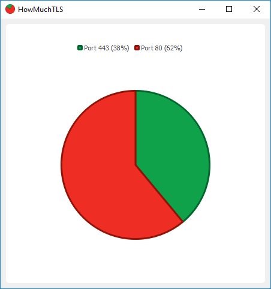

# HowMuchTLS

Simple program to check the amount of port 80 traffic compared to port 443 traffic. Tested on Windows 10 x64.

## Installation/usage
1. Install [WinPcap](https://www.winpcap.org/install/default.htm) if it's not installed yet
2. Download dist/HowMuchTLSx64.zip
3. Unzip the file from step 2 and start HowMuchTLS.exe
4. Visit some TLS-encrypted and unencrypted websites, the pie slices should reflect those visists

## How it works
It's kind of simple and stupid. Libpcap is used to filter out traffic going to port 80 and port 443. Qt is then used to create a piechart that shows the relative amount of secure traffic compared to unsecure traffic. Port 80 can be used for secured traffic while 443 can be used for unsecured traffic. So there is no 100% guarantee that the traffic really to those port is secure/unsecure. There's no inspection of the traffic itself.

## Development
HowMuchTLS is developed in Visual Studio 2017. The program depends on Qt >= 5.9 and WinPcap >= 4.1.3.
- Get the latest [QT development pack](https://www.qt.io/download-open-source/)
- To make your life easier, install the Qt VS Tools
- Get the latest [WinPcap development pack](https://www.winpcap.org/devel.htm)
- Make sure the you set the header and library directories in the Visual Studio Project
- To make your life easier, install the [Qt VS Tools](https://download.qt.io/development_releases/vsaddin/).
